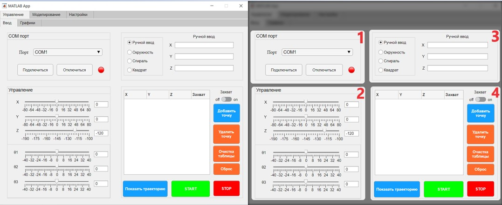
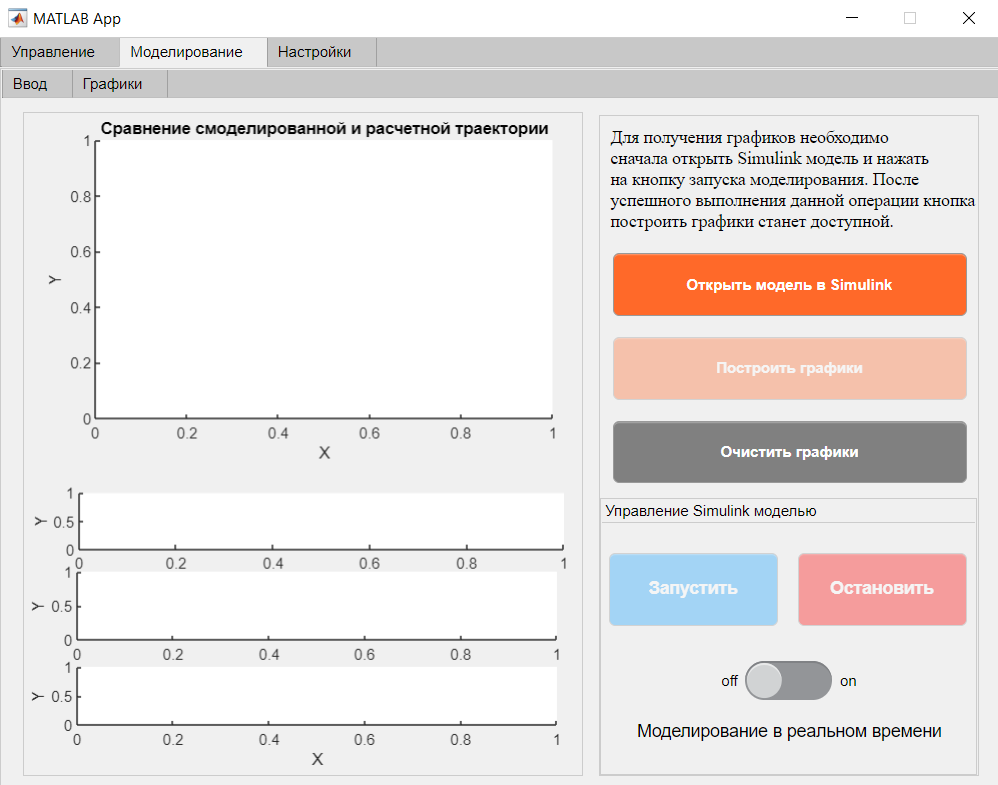
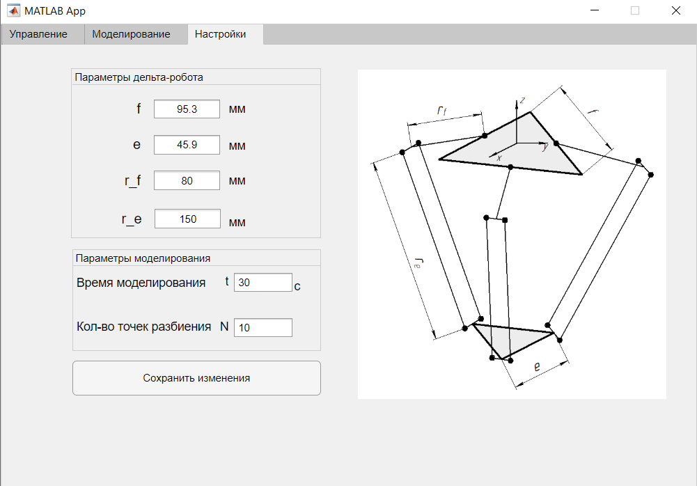
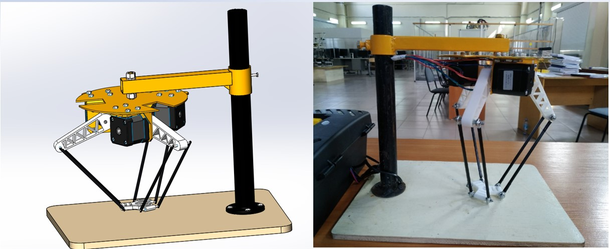

# Приложение для управления дельта-роботом

## Навигация

## Описание проекта

Приложение для управления дельта-роботом с тремя степенями свободы.
### Функциональность

1. Ручное управление механизмом при помощи слайдеров
2. Возможность ввода траектории движения выходного звена в парамметрическом виде
3. Возможность сохранения текущего положения механизма в таблицу для целью задания траектории движения по точкам
4. Моделирования и получение графиков с Simulink
5. Режим моделирования в реальном времени

## :hammer: Как начать
1. Скачать данный репозиторий
    * Вариант 1
        1. Установить [Git](https://git-scm.com/download/win)
        2. Клонировать репозиторий
           ```bash
           git clone https://github.com/Su1tan05/Delta-robot-control
           cd Delta-robot-control
           ```
    * Вариант 2 - [Скачать ZIP](https://github.com/Su1tan05/Delta-robot-control/archive/refs/heads/main.zip)

3. Запустить *DeltaRobotControl.mlappinstall* и дождаться процесса установки
## Интерфейс приложения

### Начальный экран


  1 - Подключение к STM32F411RE через последовательный порт</br>
  2 - Ручное управление</br>
  3 - Ввод траектории в парамметрическом виде</br>
  4 - Запись координат точек в таблицу</br>
  
### Моделирование


### Настройки


## 3D модель и лабораторный стенд


## Использованные библиотеки
* [Serial Port Devices](https://www.mathworks.com/help/matlab/serial-port-devices.html) - работа с COM портом
